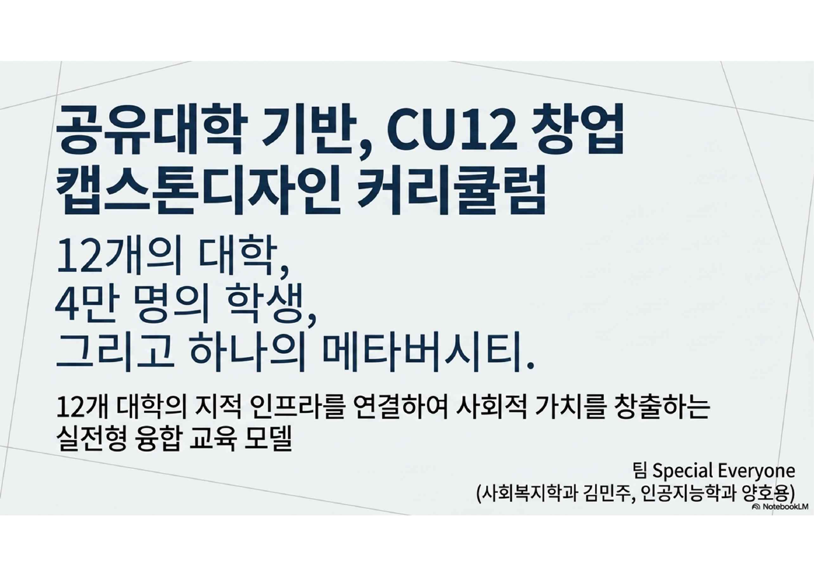
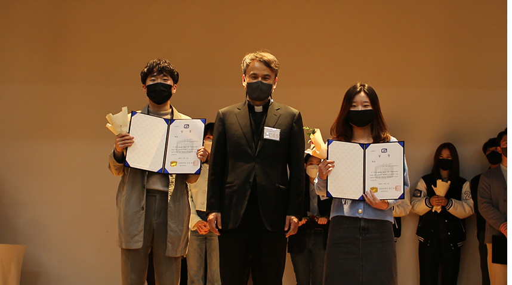

# Competition & Activities Portfolio

양호용의 대회 참가, 수상 경험, 대외활동, 포트폴리오형 결과물을 정리한 저장소입니다.  
개발 프로젝트와 학교 팀 프로젝트는 별도 저장소로 분리하고, 이 저장소에서는 **대회에서 어떤 문제를 다뤘고, 어떤 역할을 맡았으며, 어떤 결과물을 만들었는지**를 중심으로 기록합니다.

## Portfolio List

| Portfolio | Type | Result | Role |
| --- | --- | --- | --- |
| [가톨릭대 AI CUK 혁신대회](./가톨릭대_ai_cuk_혁신대회) | UX Research / Service Planning | 제4회 CUK혁신 아이디어 경진대회 장려상 | 발표 담당, HTML 프로토타입 제작, 접근성 개선안 정리 |
| [Debate Award Portfolio](./debate-award-portfolio) | Debate / Policy Analysis | 제12회 가톨릭대학생 토론대회 대상 | 토론 준비, 자료 조사, 찬성 측 논리 구성 |
| [NYPC Portfolio](./nypc_portfolio_upload%20(2)) | Web Portfolio / Competition | NYPC 지원용 웹 포트폴리오 | 웹 포트폴리오 구성 및 결과물 정리 |

## 1. 가톨릭대 AI CUK 혁신대회

[가톨릭대 AI CUK 혁신대회 포트폴리오](./가톨릭대_ai_cuk_혁신대회)

공유대학(CU12) 환경에서 장애학생과 다양한 학습자가 강의 수강, 자료 접근, 팀 협업 과정에서 겪을 수 있는 접근성 문제를 분석하고 서비스 개선안을 제안한 프로젝트입니다.




### Key Points

- 제4회 CUK혁신 아이디어 경진대회 장려상 수상
- 팀명: `Special Everyone`
- 공유대학 장애학생 접근성 개선 UX 리서치
- AI 자막, OCR 자료 점검, 접근성 태그, 확장 버튼 UI 제안
- `공유대학` HTML 웹 프로토타입 직접 제작
- 발표 담당

### Links

- [README](./가톨릭대_ai_cuk_혁신대회)
- [Web Prototype](./가톨릭대_ai_cuk_혁신대회/index.html)
- GitHub Pages: `https://yongnyong.github.io/competition-yong/가톨릭대_ai_cuk_혁신대회/`

### Keywords

`Accessibility` `UX Research` `Service Planning` `AI Caption` `OCR` `HTML Prototype`

## 2. Debate Award Portfolio

[Debate Award Portfolio](./debate-award-portfolio)

제12회 가톨릭대학생 토론대회에서 팀 `디벨이트`로 참가해 **대상**을 수상한 경험을 정리한 포트폴리오입니다.  
온라인 플랫폼 공정화법을 중심으로 찬반 쟁점을 분석하고, 플랫폼 사업자, 입점업체, 소비자 관점을 비교하며 찬성 측 논리를 구성했습니다.



### Key Points

- 제12회 가톨릭대학생 토론대회 대상 수상
- 온라인 플랫폼 공정화법 관련 쟁점 분석
- 입점업체 보호, 수수료, 광고비, 노출 기준 문제 정리
- 해외 플랫폼 규제 사례 비교
- 수상 사진, 상장, 준비자료 정리

### Links

- [README](./debate-award-portfolio)
- [Award Certificate](./debate-award-portfolio/docs/certificate/토론대회수상.pdf)

### Keywords

`Debate` `Grand Prize` `Policy Analysis` `Platform Regulation` `Research`

## 3. NYPC Portfolio

[NYPC Portfolio](./nypc_portfolio_upload%20(2))

NYPC 대회 지원 및 활동 정리를 위해 제작한 웹 포트폴리오입니다.  
대회 관련 활동, 자기소개형 콘텐츠, 웹 기반 포트폴리오 결과물을 정리하는 용도로 구성했습니다.

| Result | Rank List |
| --- | --- |
|  |  |

### Key Points

- NYPC 지원용 웹 포트폴리오
- HTML 기반 포트폴리오 페이지 구성
- 대회/활동 관련 콘텐츠 정리
- 웹 결과물 형태로 확인 가능

### Links

- [Portfolio Folder](./nypc_portfolio_upload%20(2))

### Keywords

`NYPC` `Web Portfolio` `HTML` `Competition`

## Repository Structure

```text
competition-yong/
├── README.md
├── 가톨릭대_ai_cuk_혁신대회/
├── debate-award-portfolio/
└── nypc_portfolio_upload (2)/
```

## Related Repositories

| Repository | Description |
| --- | --- |
| [tovnet](https://github.com/yongnyong/tovnet) | 현장 업무 기반 R&D 및 개발 포트폴리오 |
| [School-Projects](https://github.com/yongnyong/School-Projects) | 학교 팀 프로젝트 및 코드 기반 과제 모음 |

## About This Repository

이 저장소는 대회와 대외활동 경험을 단순히 나열하는 것이 아니라, 다음 기준으로 정리합니다.

- 어떤 문제를 다뤘는가
- 어떤 자료를 조사했는가
- 어떤 결과물을 만들었는가
- 팀에서 어떤 역할을 맡았는가
- 수상 또는 활동 결과가 무엇인가

## Contact

- GitHub: [yongnyong](https://github.com/yongnyong)
