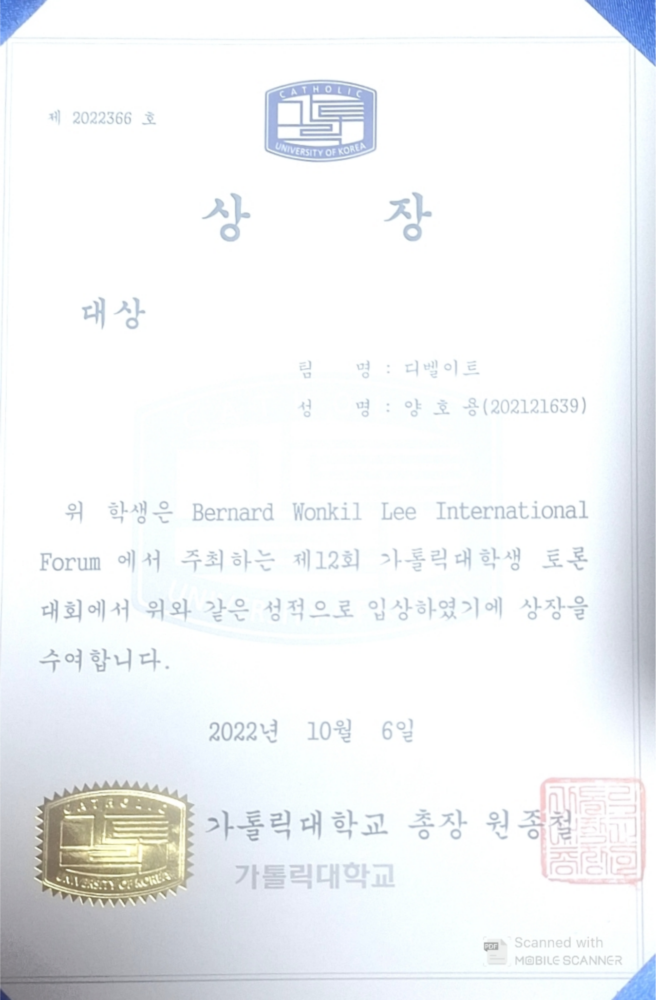

# 12th Catholic University Student Debate Competition - Grand Prize

가톨릭대학교 Bernarda Wonkil Lee International Forum에서 주최한 **제12회 가톨릭대학생 토론대회**에서 팀 `디벨이트`로 참가해 **대상**을 수상한 경험입니다.


## Award Summary

| 항목 | 내용 |
| --- | --- |
| 수상명 | 대상 |
| 대회명 | 제12회 가톨릭대학생 토론대회 |
| 주최 | Bernarda Wonkil Lee International Forum |
| 소속/이름 | 양호용 |
| 팀명 | 디벨이트 |
| 수상일 | 2022년 10월 6일 |
| 관련 기사 | [CUK Holds the 12th BWL International Forum for Catholic Humanism](https://www.catholic.ac.kr/en/newsroom/photonews.do?mode=view&articleNo=216038&title=CUK+Holds+the+12th+BWL+International+Forum+for+Catholic+Humanism) |

## Certificate



## Why This Matters

이 수상 경험은 단순한 발표 경험이 아니라, 주어진 논제에 대해 자료를 분석하고 논리 구조를 설계한 뒤 제한된 시간 안에 설득력 있게 전달한 경험입니다.

토론대회 과정에서 다음 역량을 보여줄 수 있었습니다.

- 논제 분석과 쟁점 도출
- 근거 기반 주장 구성
- 반론 예상과 대응 논리 준비
- 팀 내 역할 조율과 발화 전략 구성
- 심사위원과 청중을 고려한 설득형 커뮤니케이션

## My Contribution

팀 `디벨이트`의 구성원으로 참여해 토론 준비와 본선 발표 과정에 기여했습니다.

포트폴리오에서 강조할 수 있는 기여는 다음과 같습니다.

- 토론 주제에 대한 자료 조사 및 쟁점 정리
- 찬반 논리 구조 설계
- 예상 반론 정리와 대응 근거 준비
- 팀원 간 발언 순서와 역할 조율
- 본선 토론에서 논리적 전달과 즉각적인 반박 수행

## Portfolio Keywords

`Debate` `Grand Prize` `Communication` `Logical Thinking` `Critical Thinking` `Team Collaboration` `Presentation`

## Files

```text
docs/images/award-photo.png
docs/images/award-certificate.png
docs/certificate/토론대회수상.pdf
```
