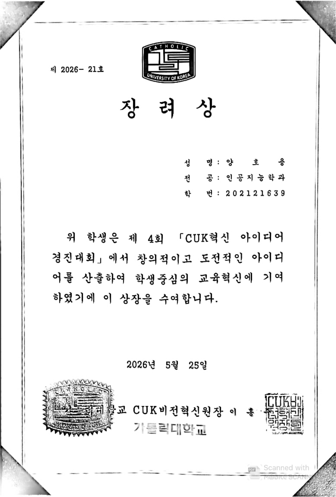
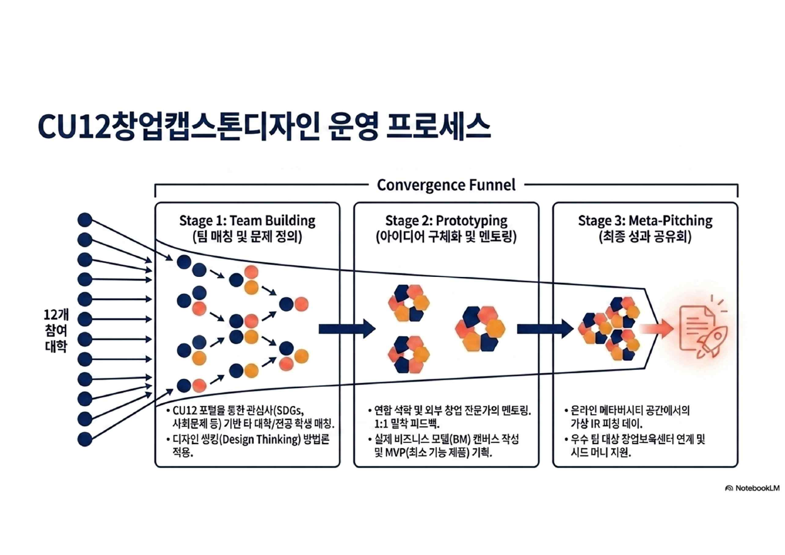
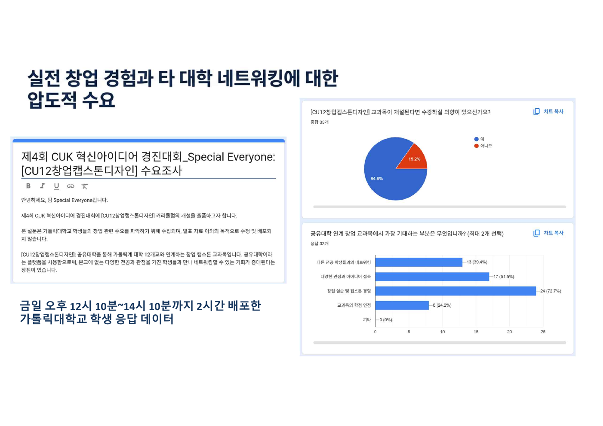
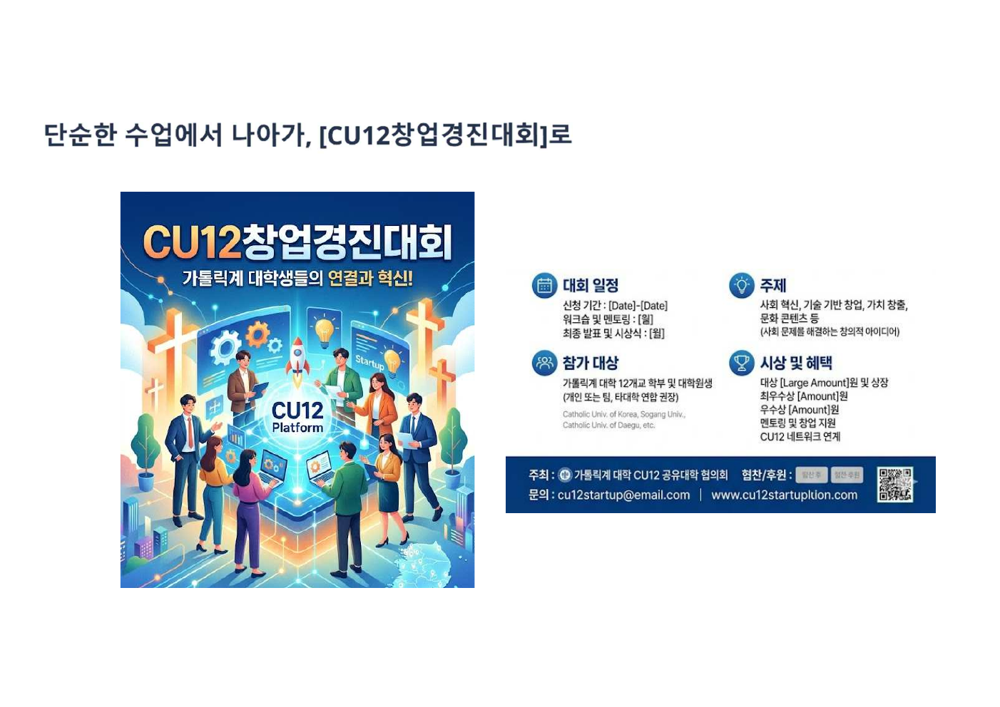
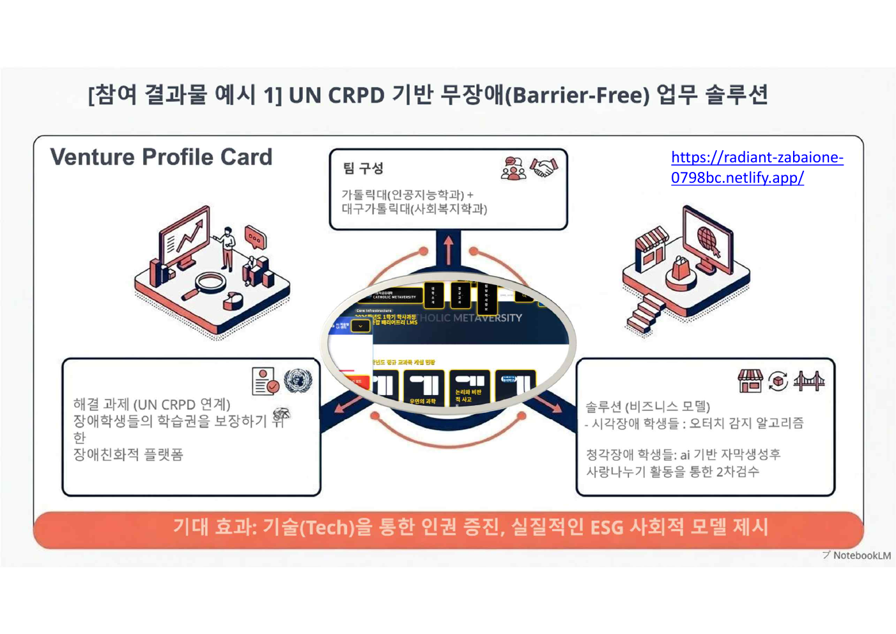

# Special Everyone | CU12 Shared University Accessibility Portfolio

제4회 **CUK혁신 아이디어 경진대회**에서 팀 `Special Everyone`으로 참여해 **장려상**을 수상한 프로젝트입니다.  
공유대학(CU12) 환경에서 장애학생과 다양한 학습자가 강의 수강, 자료 접근, 팀 협업 과정에서 겪을 수 있는 접근성 문제를 분석하고, AI 자막·OCR 자료 점검·접근성 태그·확장 버튼 UI를 포함한 서비스 개선안을 제안했습니다.

## Links

| Type | Link |
| --- | --- |
| Web Prototype | [CU12 공유대학 통합 포털 열기](./index.html) |
| GitHub Pages URL | `https://yongnyong.github.io/competition-yong/special-everyone-portfolio/` |
| Presentation PDF | [special-everyone-presentation.pdf](./docs/presentation/special-everyone-presentation.pdf) |
| Award Certificate | [cuk-ai-innovation-award.pdf](./docs/certificate/cuk-ai-innovation-award.pdf) |

> GitHub에서 README 안의 `index.html` 링크는 코드 화면으로 보일 수 있습니다.  
> 실제 페이지처럼 보려면 `competition-yong` 저장소에서 GitHub Pages를 켠 뒤 위 GitHub Pages URL로 접속하면 됩니다.


## Award



| Item | Detail |
| --- | --- |
| Award | 장려상 |
| Competition | 제4회 CUK혁신 아이디어 경진대회 |
| Team | Special Everyone |
| Recipient | 양호용 |
| Major | 인공지능학과 |
| Date | 2026년 5월 25일 |
| Organizer | 가톨릭대학교 CUK비전혁신원 |

## Project Summary

| Item | Detail |
| --- | --- |
| Project Name | Special Everyone |
| Topic | 공유대학 장애학생 접근성 개선 UX 리서치 및 서비스 기획 |
| Field | UX Research, Service Planning, Accessibility, AI-assisted Learning |
| Target Service | 가톨릭공유대학(CU12) 통합 포털 |
| Output | 발표자료, 리서치 인사이트 포트폴리오, HTML 웹 프로토타입, 수상 증빙 |

## My Role

- `Special Everyone` 팀 프로젝트 참여
- 공유대학 접근성 문제에 대한 리서치 기반 인사이트 정리
- 발표자료 구성 및 실제 발표 담당
- `공유대학` HTML 웹 프로토타입 직접 제작
- 장애학생 접근성 개선 방향을 서비스 기능 단위로 구체화

## Problem Definition

공유대학은 단순히 강의를 공유하는 시스템이 아니라, 여러 대학 학생들이 함께 수강하고 협업하며 캡스톤 프로젝트까지 확장되는 학습 플랫폼입니다.

이 과정에서 장애학생은 다음과 같은 문제를 겪을 수 있습니다.

- 수강 전 강의 접근성 정보를 확인하기 어려움
- AI 자동 자막의 전문용어, 화자 구분 오류
- 이미지형 PDF, 대체 텍스트 부족으로 인한 자료 접근성 문제
- 작은 버튼과 복잡한 메뉴 구조로 인한 조작 부담
- 팀 협업 방식과 지원 조건이 명확하지 않아 참여가 위축됨

이 프로젝트는 접근성을 “특정 사용자만을 위한 추가 기능”이 아니라, **강의 선택과 협업 참여를 가능하게 만드는 기본 정보 구조**로 정의했습니다.

## Research Insight



프로젝트에서는 CU12 창업 캡스톤디자인 운영 흐름을 기준으로 문제를 구조화했습니다.

| Insight | Service Direction |
| --- | --- |
| 수강 전 정보 부족 | 강의 목록과 상세 페이지에 접근성 태그 제공 |
| 자막 품질 한계 | AI 자동 자막 + 학생 검수 구조 |
| 자료 접근성 부족 | OCR 점검 및 대체자료 제공 |
| 조작 부담 | 오터치 감지 및 확장 버튼 UI |
| 팀 참여 조건 불명확 | 팀 모집 단계에서 협업 조건 표시 |

## Validation



발표자료에는 실제 학생 응답 데이터를 바탕으로 한 현장 검증 흐름도 포함되어 있습니다.  
이를 통해 공유대학 서비스가 단순 강의 제공을 넘어 협업과 참여 중심 플랫폼으로 확장될 필요가 있음을 제시했습니다.

## Service Proposal



최종 제안은 `CU12 창업경진대회`와 연계한 공유대학 서비스 모델입니다.

핵심 방향:

- 12개 대학, 약 4만 명 학생이 참여할 수 있는 연합형 학습 구조
- 장애학생과 비장애학생이 함께 참여 가능한 접근성 중심 설계
- AI 자동화와 사람 기반 검수를 결합한 지속 가능한 운영 구조
- 강의 수강, 자료 확인, 팀 모집, 발표까지 이어지는 통합 서비스 흐름

## Web Prototype



`공유대학 (1).html`은 직접 제작한 CU12 공유대학 통합 포털 프로토타입입니다.

주요 구성:

- CU12 공유대학 소개
- 정규교과/비교과 과정 메뉴 구조
- 로그인 및 언어 선택 UI
- 접근성 개선 아이디어를 반영할 수 있는 포털형 레이아웃

실제 페이지 확인:

- Local / Repository: [index.html](./index.html)
- GitHub Pages: `https://yongnyong.github.io/competition-yong/special-everyone-portfolio/`

## Files

```text
special-everyone-portfolio/
├── README.md
├── index.html
├── web/
│   └── cu12-shared-university-portal.html
└── docs/
    ├── images/
    │   ├── slide-cover-01.png
    │   ├── slide-process-03.png
    │   ├── slide-survey-05.png
    │   ├── slide-competition-07.png
    │   ├── slide-prototype-09.png
    │   └── award-certificate.png
    ├── presentation/
    │   ├── research-insight-special-everyone.pptx
    │   └── special-everyone-presentation.pdf
    └── certificate/
        └── cuk-ai-innovation-award.pdf
```

## Keywords

`Accessibility` `UX Research` `Service Planning` `AI Caption` `OCR` `CU12` `Shared University` `HTML Prototype` `Competition Award`

